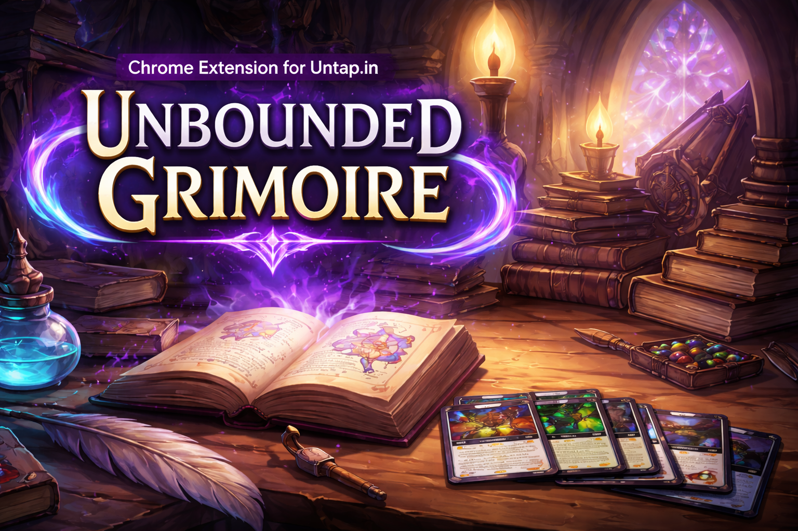

<p align="center">
  
</p>

# Boundless Grimoire

Local-first deckbuilder overlay for [untap.in](https://untap.in). Uses Scryfall for card data; decks live in `chrome.storage`.

## Monorepo structure

| Package | Role |
|---|---|
| `packages/app` | Deck-builder UI, stores, and service interfaces. Environment-agnostic. |
| `packages/ui` | Design library: primitive components + brand mark, Tailwind v4 theme. |
| `extensions/boundless-grimoire` | Chrome shell: boot wiring, chrome.storage/RPC/untap service impls, service worker, untapBridge. |
| `sites/homepage` | Astro marketing site with `/demo` route (browser-native service impls). |

## Prerequisites

- [Node.js](https://nodejs.org/) 22+
- [pnpm](https://pnpm.io/) 10+

## Setup

```bash
pnpm install
```

## Build

```bash
pnpm --filter boundless-grimoire build
```

The built extension lands in `extensions/boundless-grimoire/dist/`.

## Development (watch mode)

```bash
pnpm --filter boundless-grimoire watch
```

Rebuilds the extension into `dist/` on every file change. Load the extension from `extensions/boundless-grimoire/dist/` in Chrome and manually reload it after each rebuild.

## Install in Chrome

1. Build the extension (see above).
2. Open `chrome://extensions`.
3. Enable **Developer mode** (top-right toggle).
4. Click **Load unpacked** and select the `extensions/boundless-grimoire/dist/` folder.
5. Navigate to [untap.in](https://untap.in) — the overlay button appears in the top-left corner.

## Homepage (marketing site + demo)

```bash
pnpm --filter boundless-grimoire-homepage dev
```

Starts the Astro dev server. The `/demo` route runs the full deck-builder in the browser without the Chrome extension.

## Type checking

```bash
pnpm --filter boundless-grimoire typecheck
```
